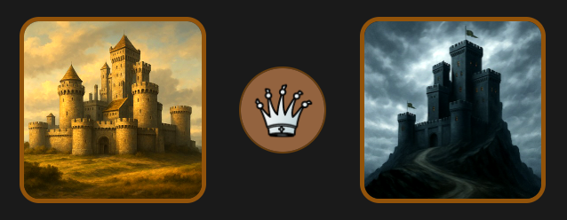

# Chesser

A web application for managing your chess opening repertoire and
practicing with spaced repetition.

This is a _hobby_ project: a single-user application with white and black repertoires
organized by chapters. That said, it’s robust and capable. As of January 2026 I've been
using it for my 1,200+ variation repertoire since March 2025, completing roughly 14,500
reviews.

Chesser is intentionally simple and pleasant to work on: SQLite locally, a lightweight
Alpine.js frontend with no build step, and straightforward deployment. It benefits from
the Django framework with its powerful built-in admin, although most tasks are
accomplished in the app UI.

I use [Railway](https://railway.com/) and deploy directly from GitHub. A demo version
is available at [chesser-demo.up.railway.app](https://chesser-demo.up.railway.app/).
More on [local/hosted](#local-development) usage below!

## Why I built Chesser

I used [Chessable](https://www.chessable.com/) for five years and liked the platform.
The killer feature there is all the great content. But as I painstakingly built up my
repertoire, I was mistrustful about how well they would maintain things. Import and
exporting wasn't very comprehensive. The UI for editing things is clunky, and I get the
feeling their hands are tied with improving it. I mostly notice cosmetic updates.

For example, saving a variation results in two modal dialogs in sequence:

1. “Update variation? You are about to update this variation, go ahead?”
2. “Done! You've updated the variation. Would you like to see it?”

Playing a new move can trigger an even longer warning explaining that the variation is
now considered a new one—and ending with “We will improve this process in the next
iteration of this tool.” That message has been there for six years.

To be fair to Chessable, they are supporting a large userbase and a lot of authors and
content. It’s much easier for a single-user app to sidestep these issues and prioritize
clarity over backward compatibility.

This isn’t to rag on Chessable, but to offer a simpler, open, and transparent system—one
where your data is yours, the formats are inspectable, and the software can be run and
modified without permission.

The import/export JSON format is intended to benefit the free software community if it’s
adopted. It already supports rich concepts like alternate moves and board shapes–illustrative
arrows and circles and their colors. (See [sample_repertoire.json][1].)
A more ambitious developer could extend Chesser to be multiuser and add support for courses.

[1]: https://github.com/scarpent/chesser/blob/main/examples/sample_repertoire.json

As it stands, you can run your own Chesser locally or as a hosted instance with little
effort and expense. (For example, I run it on a $5/month hobby account on Railway.)

## "Issues"

(Maybe create actual issues in github)

- Mobile: Restart/Show move buttons stay highlighted
- Mobile: Scroll to top on edit screen
- Auto reload _mostly_ happens, but not always (but works sorta well and not worth more effort)
- (not really an issue, but...) variation editing has one key limitation with building up the line -- you don't do that in the app...

- responsive -- mobile is tuned to my device but hoping it will be generally reasonable

## Open / ToDo

Things I'd be willing to work on if important to actual users of the app:

- A light mode (at least, I can see refactoring CSS to better support variables and customization)
- PGN import (I import from stuff I extracted from chessable and haven't worked with PGN examples, but would like to make this as robust as possible.)
- Subvariation rendering: The parser/renderer can be extended to do more. I expected it to do more but I'm happy with the current state of things. I didn't find more patterns from my chessable data to automate more things -- I'd rather manually fix at this point. HOWEVER, if others can show samples of a recurring pattern I'd be curious to see about handling it.

## Thank you / Attribution

Some of the great free software libraries and resources that made chesser possible:

- python/django
- python-chess
- chessground
- chess.js
- alpine
- googlefonts/noto-emoji OFL-1.1
  ~ Emoji icons derived from Noto Emoji, licensed under the SIL Open Font License, Version 1.1.
- wikibooks openings
- "fantasy" piece set for queen logo
  ~ https://github.com/maurimo/chess-art
  ~ https://maurimo.github.io/chess-art/configure.html

## Home Page

| UI Element                                       | What It Is                                                       |
| ------------------------------------------------ | ---------------------------------------------------------------- |
|       | _Logo_ always returns to root homepage.                          |
|  | _White Book:_ Homepage showing white repertoire chapters.        |
|  | _Black Book:_ Same for black repertoire.                         |
|           | _Stats_ for reviews: daily, weekly, etc.                         |
|         | _Review:_ Start/continue quiz session for currently due reviews. |
|         | _Import (and Export)_ via miscellaneous formats.                 |
|         | _Random Review:_ “Extra study” review chosen at random.          |
|       | _Puzzles:_ Open lichess puzzle training page.                    |
| (text link)                                      | _Admin:_ Open Django admin. (Unavailable in demo mode.)          |

## Review Page

| UI Element                                      | What It Is                                                           |
| ----------------------------------------------- | -------------------------------------------------------------------- |
|         | _Home:_ Return to homepage.                                          |
|      | _Restart_ current variation review. (Resets failure state.)          |
|   | _Show Move:_ Reveal correct move. (Fails quiz unless restarted.)     |
|            | _Variation Info:_ Toggle variation details.                          |
|  | _View:_ Open full variation view. (“Book” view.)                     |
|            | _Edit:_ Open variation editor.                                       |
|    | _Analysis:_ Open line in Lichess analysis board at the current move. |
| 🟢🟡🔴                                          | TBD (To Be Documented)                                               |

### Review Completion Toolbar

|                                               |                                                                            |
| --------------------------------------------- | -------------------------------------------------------------------------- |
|          | _Mainline Back:_ Step backward through the variation. (Arrow Left.)        |
|    | _Mainline Forward:_ Step forward through the variation. (Arrow Right.)     |
| 🟢🔴🔰🌿😬, etc.                              | _Status:_ Result of the review. There is a progression of good/bad emojis. |
|      | _Review:_ Continue quiz session.                                           |
|  | _Complete:_ No more reviews! (Returns to homepage.)                        |

Review session stats are somewhat sticky. You can leave an active session and come back and it will resume if “not too much” time has passed.

“Extra study” text will be red if initiated from failed quiz, green otherwise.

## Local Development

Mac-centric but we can make things more agnostic as needed.

- venv
- install requirements
- run.sh
- ...detailed instructions to follow...

## Railway

- add github service, connect to repo
- add postgress db
- configure environment variaables
- deploy!
- ...detailed instructions to follow...
